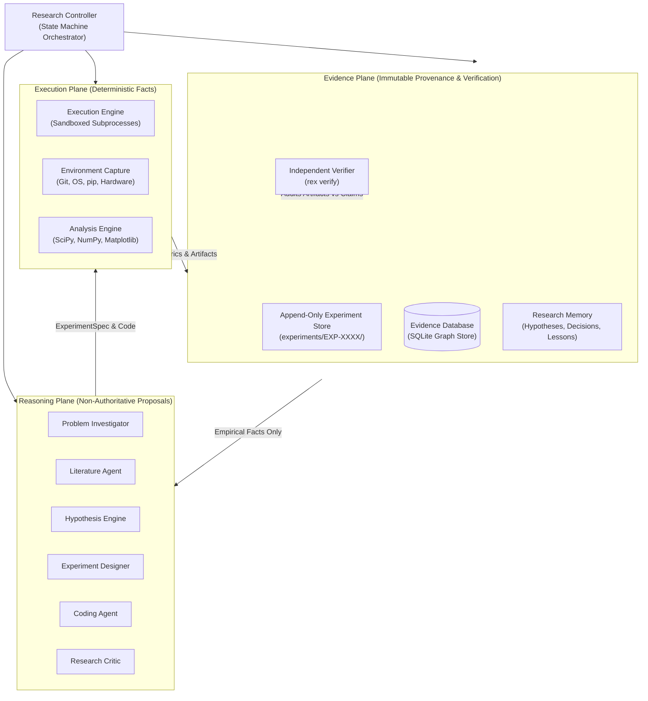
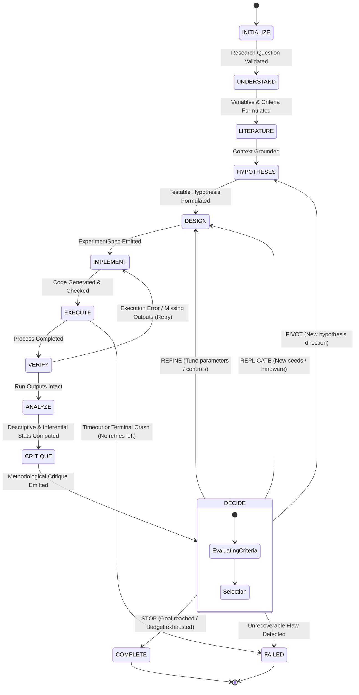
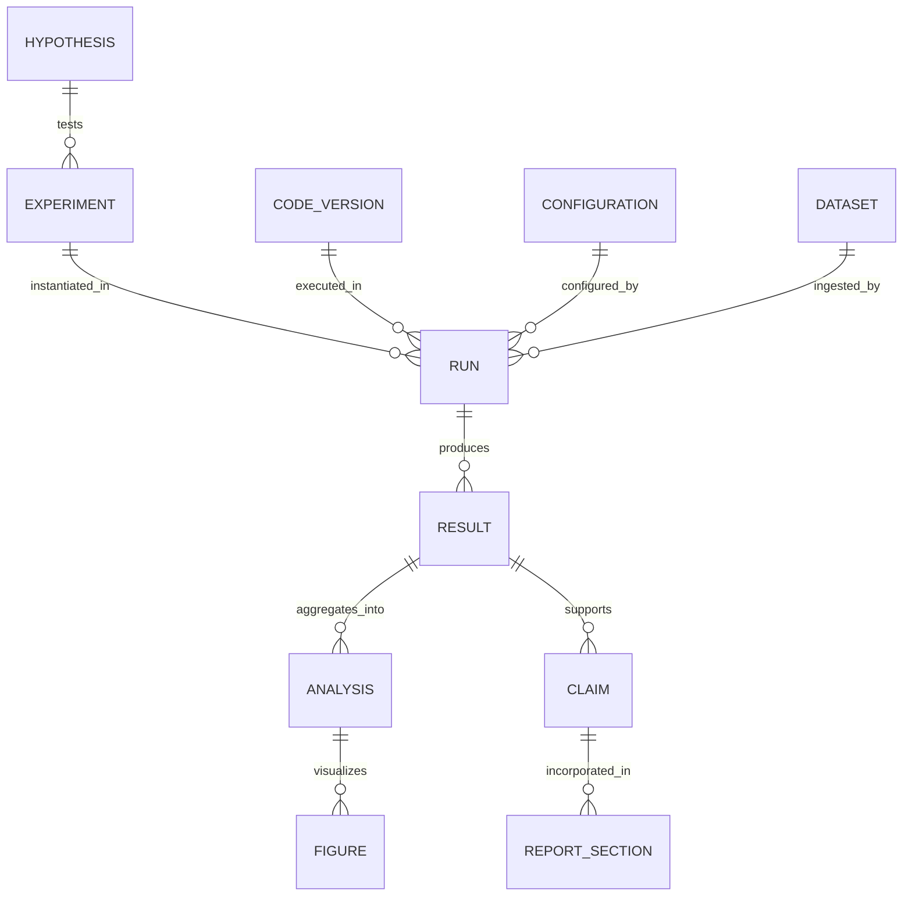

# ARCHITECTURE.md — REX System Architecture

## 1. System Overview

**REX (Research Experiment Engineer)** is an autonomous computational research system structured around three logically isolated planes:

1. **Reasoning Plane**: LLM agents that decompose research questions, formulate hypotheses, design experiments, write code, and critique results.
2. **Execution Plane**: Deterministic software that runs code in sandboxes, captures runtime telemetry, executes statistical analysis, and renders figures.
3. **Evidence Plane**: An immutable, relational/graph persistence layer that captures the complete provenance chain from raw bytes to high-level research claims.



---

## 2. The Three Planes in Detail

### 2.1 The Reasoning Plane
- **Role**: Creative and analytical proposal generator.
- **Constraints**: 
  - Never allowed to generate authoritative numbers or calculate statistics in LLM weights.
  - Must output structured, strictly validated schemas (Pydantic models).
  - Constrained by prompt contracts; if an experiment fails, the Coding Agent must fix the code, not modify the experiment specification contract.

### 2.2 The Execution Plane
- **Role**: Deterministic truth-producer.
- **Constraints**:
  - Code runs under an isolated subprocess environment with configurable wall-clock timeouts, memory limits, and execution quotas.
  - Stdout, stderr, exit codes, CPU/RAM telemetry, and disk artifacts are streamed and captured deterministically.
  - The `AnalysisEngine` strictly uses NumPy and SciPy for statistics (95% confidence intervals, Welch's t-test, Cohen's $d$, Mann-Whitney $U$, bootstrap sampling) and Matplotlib for figures.

### 2.3 The Evidence Plane
- **Role**: Immutable historical record and machine-readable provenance graph.
- **Constraints**:
  - Append-only filesystem organization. No execution run or historical metric file is ever overwritten.
  - Uses SQLite with foreign keys and strict schemas to maintain the evidence graph.
  - Computes SHA-256 digests of all code files, input configurations, datasets, and output artifacts.
  - Feeds the independent verifier (`rex verify`), which operates without any LLM in the loop.

---

## 3. The Research State Machine

The research process is orchestrated as a deterministic finite state machine (FSM).



### State Definitions & Transitions

| State | Input | Output / Action | Next State(s) |
| :--- | :--- | :--- | :--- |
| `INITIALIZE` | Research prompt, budget config | Research workspace, initialized DB, allocated ID | `UNDERSTAND`, `FAILED` |
| `UNDERSTAND` | Research question | Problem decomposition, variables, evaluation metric | `LITERATURE`, `FAILED` |
| `LITERATURE` | Problem decomposition | Verified scholarly sources (V3 stub in V1) | `HYPOTHESES` |
| `HYPOTHESES` | Problem context, literature | Structured `Hypothesis` with falsification rule | `DESIGN`, `FAILED` |
| `DESIGN` | Target `Hypothesis` | Immutable `ExperimentSpec` (variables, seeds, controls) | `IMPLEMENT` |
| `IMPLEMENT` | `ExperimentSpec` | `run.py`, `config.json`, requirements in `source/` | `EXECUTE` |
| `EXECUTE` | Experiment directory, sandbox config | `executions/RUN-XXXX/` with logs & `metrics.json` | `VERIFY`, `FAILED` |
| `VERIFY` | Run folder, `metrics.json` | Verification of exit code 0 and metric schema | `ANALYZE` (if ok), `IMPLEMENT` (if bug) |
| `ANALYZE` | Multiple execution runs | `analysis/stats.json`, plots, effect sizes | `CRITIQUE` |
| `CRITIQUE` | Spec, runs, statistical summary | Methodological critique (`CRITICAL`, `WARNING`, `INFO`) | `DECIDE` |
| `DECIDE` | Critique, remaining budget, results | Action: `REFINE`, `REPLICATE`, `PIVOT`, `STOP` | `DESIGN`, `HYPOTHESES`, `COMPLETE`, `FAILED` |
| `COMPLETE` | Evidence graph, final claims | `verification_report.json`, research report | Terminal |
| `FAILED` | Error context, stack trace | Failure record in evidence store | Terminal |

---

## 4. Subsystem Specifications

### 4.1 Research Controller (`rex.core.controller`)
- Manages the lifecycle FSM.
- Tracks compute budget (max iterations, max execution seconds, token limits).
- Coordinates handoffs between reasoning agents and execution components.
- Handles run pause, resume, and checkpointing.

### 4.2 Problem Investigator (`rex.planes.reasoning.investigator`)
- Deconstructs high-level questions into:
  - Independent variables (e.g. learning rate, chunk size, retrieval model).
  - Dependent variables (e.g. accuracy, latency, perplexity).
  - Fixed controls (e.g. dataset split, model weights, batch size).
  - Baseline comparison target.

### 4.3 Hypothesis Engine (`rex.planes.reasoning.hypothesis`)
- Creates testable, falsifiable hypotheses.
- **Contract Schema**:
  ```python
  class Hypothesis(BaseModel):
      hypothesis_id: str
      research_id: str
      statement: str
      expected_direction: Literal["increase", "decrease", "no_effect", "nonlinear"]
      mechanism_rationale: str
      falsification_condition: str
      required_evidence: list[str]
      status: Literal["proposed", "supported", "refuted", "inconclusive"] = "proposed"
  ```

### 4.4 Experiment Designer (`rex.planes.reasoning.designer`)
- Emits the immutable `ExperimentSpec`.
- **Contract Schema**:
  ```python
  class ExperimentSpec(BaseModel):
      experiment_id: str
      hypothesis_id: str
      objective: str
      independent_variables: dict[str, Any]
      dependent_variables: list[str]
      controls: dict[str, Any]
      baseline: dict[str, Any]
      dataset_descriptor: dict[str, Any]
      evaluation_metrics: list[str]
      repetitions: int
      random_seeds: list[int]
      statistical_tests: list[str]
      success_criteria: str
      falsification_criteria: str
  ```

### 4.5 Coding Agent (`rex.planes.reasoning.coder`)
- Translates `ExperimentSpec` into executable Python code (`source/run.py`).
- Rules:
  - Must write structured outputs to `metrics.json`.
  - Must accept `--seed` and parameter flags via CLI or read `config.json`.
  - Must not import forbidden packages.
  - Can be called iteratively in case of syntax/runtime errors during `EXECUTE` (up to a configurable retry limit).

### 4.6 Execution Engine & Sandbox (`rex.planes.execution.runner`, `sandbox`)
- Runs code inside an isolated environment.
- Enforces:
  - Process group isolation (prevents orphan processes on Windows/Linux).
  - Timeout enforcement (SIGTERM followed by SIGKILL).
  - Capture of exit code, duration, memory peak, stdout, and stderr.
  - Generation of unique execution ID: `RUN-0001`, `RUN-0002`, etc.
  - Calculation of SHA-256 checksums of source code and configurations.

### 4.7 Analysis Engine (`rex.planes.execution.analyzer`)
- Computes deterministic statistics over raw execution metrics:
  - Sample mean, median, standard deviation, interquartile range (IQR).
  - 95% Confidence Intervals (Student's $t$ or BCa Bootstrap).
  - Hypothesis testing: Paired/Independent Student's $t$-test, Welch's $t$-test, Wilcoxon signed-rank.
  - Effect size: Cohen's $d$, Hedge's $g$.
  - Anomaly and outlier detection (IQR rule, $Z$-score).
  - Generates publication-quality charts (PNG/SVG) and stores source plotting data in `analysis/`.

### 4.8 Research Critic (`rex.planes.reasoning.critic`)
- Audits experimental design and execution facts:
  - Baseline fairness (is the baseline tuned equivalently?).
  - Leakage checks (train/test contamination).
  - Confounding variables.
  - Sample size and seed stability.
  - Emits findings:
    ```python
    class CritiqueFinding(BaseModel):
        severity: Literal["CRITICAL", "WARNING", "INFO"]
        category: str
        message: str
        evidence_reference: Optional[str]
        recommendation: str
    ```

### 4.9 Evidence Engine & Database (`rex.planes.evidence`)
- Manages local SQLite database storing entities and relational edges.
- Schema captures:
  - `hypotheses`
  - `experiments`
  - `code_versions`
  - `configurations`
  - `datasets`
  - `runs`
  - `results`
  - `analyses`
  - `figures`
  - `claims`
  - `edges` (graph relationships: `SUPPORTED_BY`, `PRODUCED_BY`, etc.)



### 4.10 Independent Verifier (`rex.planes.evidence.verifier`)
- Audits the entire evidence plane against disk artifacts without calling any LLM.
- Validates:
  1. Every numerical value in `Claim` matches a recorded `Result`.
  2. Every `Result` matches an actual `RUN` with exit code 0.
  3. Every `RUN` directory exists, contains `run_meta.json`, `stdout.log`, `stderr.log`, and `metrics.json`.
  4. The code SHA-256 recorded in the database matches the actual SHA-256 of `source/`.
  5. Recalculates stats from raw runs and checks for discrepancy $> 10^{-6}$.
  6. Flags any unsupported, ungrounded, or altered claims.
- Generates `verification_report.json` and `verification_report.md`.

---

## 5. Storage & Append-Only Filesystem Layout

```
experiments/
└── EXP-0001/
    ├── experiment.json        # Immutable ExperimentSpec
    ├── metadata.json          # Lineage, parent experiment, timestamps
    ├── source/                # Code snapshot
    │   ├── run.py
    │   └── requirements.txt
    ├── config/
    │   └── config.json
    ├── environment/
    │   └── env_dump.json      # Python version, git commit, packages, CPU/GPU info
    ├── executions/
    │   ├── RUN-0001/
    │   │   ├── run_meta.json  # Seed, start_time, end_time, exit_code, max_ram_mb
    │   │   ├── stdout.log
    │   │   ├── stderr.log
    │   │   └── metrics.json   # Raw outputs from run
    │   └── RUN-0002/
    │       ├── ...
    ├── results/
    │   └── aggregated.json    # Compiled raw matrix across runs
    ├── analysis/
    │   └── stats.json         # Means, CIs, p-values, effect sizes
    └── artifacts/
        └── plot_learning_curves.png
```

---

## 6. CLI Command Specifications

The user interacts with REX strictly via deterministic CLI commands:

- `rex research "<question>" [--budget-runs N] [--timeout-sec S] [--llm-model M]`
  Starts the autonomous research state machine on the given question.
- `rex status <research_id>`
  Displays current research state, active experiment, completed runs, and budget usage.
- `rex inspect <experiment_id>`
  Inspects the specification, runs, code hash, metrics, and critique for a specific experiment.
- `rex verify <research_id>`
  Runs the deterministic independent verification audit and outputs `verification_report.md`.
- `rex reproduce <experiment_id> [--run-id RUN-XXXX]`
  Reruns an exact experiment execution using the recorded seed, code, and configuration, verifying that the new output matches historical results.
- `rex report <research_id>`
  Exports the final research report with direct claim-to-evidence links.
