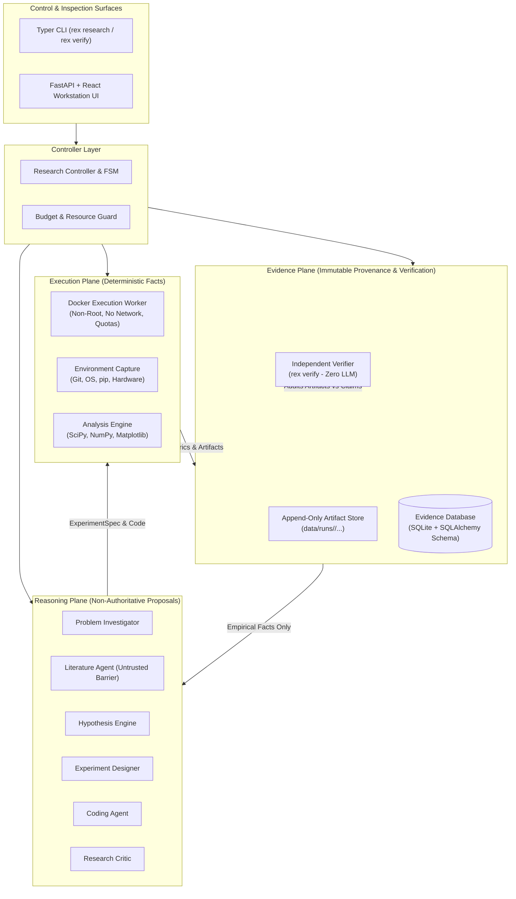
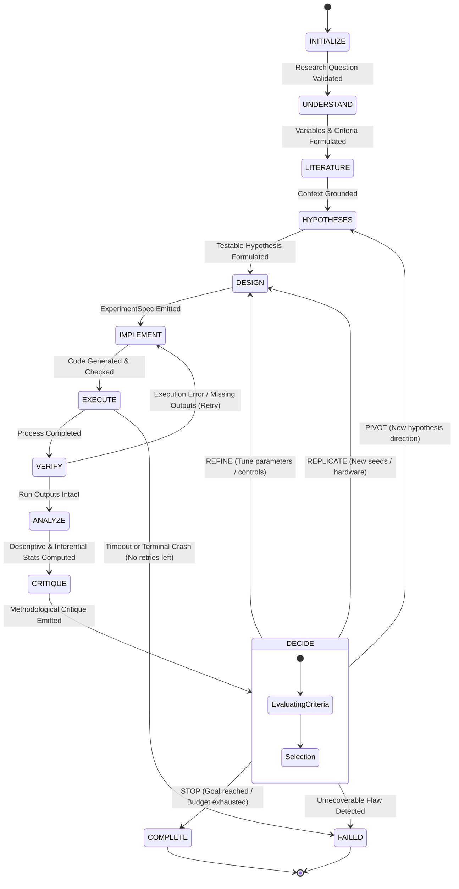
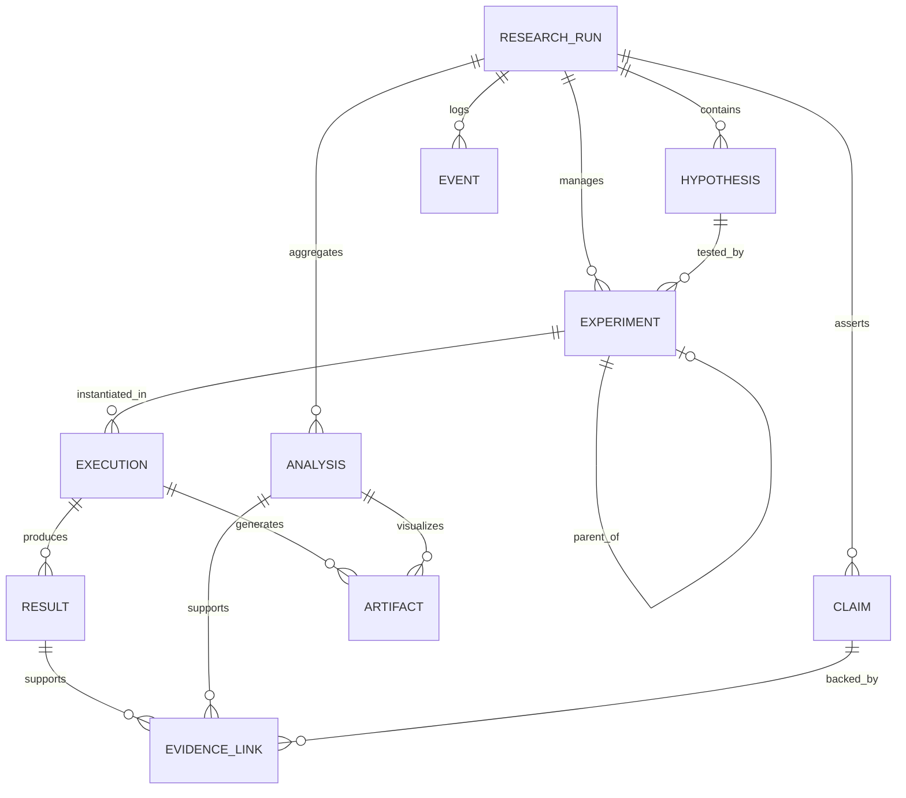

# ARCHITECTURE.md — REX System Architecture

## 1. System Overview

**REX (Research Experiment Engineer)** is an autonomous computational research system structured as a **local-first modular monolith** around three logically isolated planes:

1. **Reasoning Plane**: LLM agents that decompose research questions, formulate hypotheses, design experiments, write code, and critique results.
2. **Execution Plane**: Deterministic software that runs code in isolated Docker containers, captures runtime telemetry, executes statistical analysis, and renders figures.
3. **Evidence Plane**: An immutable, relational/graph persistence layer (SQLAlchemy + SQLite) that captures the complete provenance chain from raw bytes to high-level research claims, audited independently via `rex verify`.



---

## 2. The Three Planes in Detail

### 2.1 The Reasoning Plane
- **Role**: Creative and analytical proposal generator.
- **Constraints**: 
  - Never allowed to generate authoritative numbers or calculate statistics in LLM weights.
  - Must output structured, strictly validated schemas (Pydantic models).
  - Constrained by prompt contracts; if an experiment fails, the Coding Agent must fix the code, not modify the immutable experiment specification contract.
  - Capability-based permissions: agents only receive capabilities appropriate to their active state.
  - Prompt injection barrier: retrieved literature is treated as untrusted data and strictly quarantined from system instructions.

### 2.2 The Execution Plane
- **Role**: Deterministic truth-producer.
- **Constraints**:
  - Code runs under an isolated **Docker container** (`rex.execution.docker_runner`) with configurable wall-clock timeouts, memory limits, CPU quotas, non-root execution, and **network disabled by default**.
  - Fail-safe policy: if Docker is unavailable, the system fails closed rather than silently running untrusted code on the host. (Safe subprocess mocks are restricted to unit test suites).
  - Stdout, stderr, exit codes, CPU/RAM telemetry, and disk artifacts are captured deterministically.
  - The `AnalysisEngine` strictly uses NumPy and SciPy for statistics (95% confidence intervals, Welch's t-test, Cohen's $d$, Mann-Whitney $U$, bootstrap sampling) and Matplotlib for figures.

### 2.3 The Evidence Plane
- **Role**: Immutable historical record and machine-readable provenance graph.
- **Constraints**:
  - Append-only filesystem organization. No execution run or historical metric file is ever overwritten.
  - Relational database schema in SQLite managed via **SQLAlchemy 2.0+** and **Alembic**.
  - Computes SHA-256 digests of all code files, input configurations, datasets, and output artifacts.
  - Feeds the independent verifier (`rex verify`), which operates without any LLM in the loop.

---

## 3. The Research State Machine

The research process is orchestrated as a deterministic finite state machine (FSM).



### State Definitions & Dual Verification
- **State `VERIFY`**: The synchronous post-execution step ensuring process exit code is 0, execution did not timeout, and raw outputs (`metrics.json`) adhere to the expected result schema.
- **Independent Audit Command (`rex verify`)**: The offline/on-demand deterministic verifier that audits the complete provenance graph (`Claim → Result/Analysis → Run → Experiment → CodeVersion/Config/Dataset`), validating SHA-256 hashes against disk files, recomputing statistics, and detecting tampering.

---

## 4. Subsystem Specifications & Package Layout

```text
rex/
├── domain/          # Pydantic & domain entities (ResearchRun, Hypothesis, ExperimentSpec, RunRecord, Claim)
├── controller/      # State machine, research controller, budget engine
├── agents/          # Reasoning agents: investigator, hypothesis, designer, coder, critic
├── llm/             # LLM provider abstraction (Gemini, Groq, OpenAI, MockLLMProvider)
├── execution/       # Docker runner, sandbox, workspace manager, environment capture
├── analysis/        # Metric parser, statistics (SciPy), bootstrap, plots (Matplotlib)
├── evidence/        # Evidence graph, lineage tracking, claims, independent verifier
├── persistence/     # SQLite database, SQLAlchemy models, Alembic, repositories
├── literature/      # Scholarly providers: OpenAlex, Semantic Scholar, arXiv, injection boundary
├── reporting/       # Evidence-grounded research report generator
├── observability/   # Structured JSON logging, lifecycle events, tracing
├── config/          # Typed application settings (Pydantic BaseSettings)
├── api/             # FastAPI REST & SSE event streaming endpoints
└── cli/             # Typer CLI commands (rex research, rex verify, etc.)
```

---

## 5. Database Schema (SQLAlchemy Models)

The persistence layer defines 11 explicit relational tables:

1. `research_runs`: id, title, research_question, status, created_at, updated_at, configuration_json, budget_json.
2. `hypotheses`: id, research_run_id, statement, rationale, expected_direction, falsification_condition, status, created_at.
3. `experiments`: id, research_run_id, hypothesis_id, objective, specification_json, status, created_at, parent_experiment_id.
4. `executions`: id, experiment_id, status, started_at, finished_at, command, git_commit, code_hash, dataset_hash, configuration_hash, seed, environment_json, resource_usage_json, exit_code, stdout_artifact_id, stderr_artifact_id.
5. `results`: id, execution_id, metric_name, metric_value, metric_unit, result_json, created_at.
6. `analyses`: id, research_run_id, analysis_type, input_result_ids, method, output_json, created_at.
7. `artifacts`: id, research_run_id, execution_id (nullable), artifact_type, path, content_hash, size_bytes, metadata_json, created_at.
8. `literature_sources`: id, research_run_id, provider, external_id, title, authors_json, year, abstract, url, retrieved_at, raw_metadata_json.
9. `claims`: id, research_run_id, text, claim_type, confidence, status, created_at.
10. `evidence_links`: id, claim_id, source_type, source_id, relationship_type, created_at.
11. `events`: id, research_run_id, event_type, timestamp, actor_type, actor_id, payload_json.



---

## 6. Docker Execution Worker & Sandboxing

The primary execution sandbox (`rex.execution.docker_runner`) isolates untrusted generated code:

- **Container Image**: Controlled Python runtime image with pre-approved science/ML dependencies.
- **User**: Runs strictly as a unprivileged non-root user (`uid: 1000`).
- **Resource Constraints**:
  - Memory: `--memory="2048m" --memory-swap="2048m"`
  - CPU: `--cpus="2.0"`
  - Wall-clock timeout: Monitored via execution service with SIGTERM $\to$ SIGKILL escalation.
- **Filesystem Isolation**:
  - Container root is read-only.
  - Only the assigned execution workspace (`data/runs/<research_id>/<exp_id>/<run_id>/`) is mounted read-write.
- **Network Policy**:
  - Network is **disabled by default** (`--network=none`).
- **Secret Isolation**:
  - Host Docker socket (`/var/run/docker.sock`), SSH keys, and cloud credentials are never mounted.
  - Host environment variables are filtered; only sanitized, explicit runtime parameters are injected.

---

## 7. Research Budgets & Rate Limits

The `rex.controller.budgets` module tracks and caps resource usage:
- `max_experiments`: Maximum number of experiments permitted in a single research campaign (default: 10).
- `max_runtime_seconds`: Maximum total execution time for all runs (default: 3600s).
- `max_llm_calls`: Maximum API requests allowed to LLM providers (default: 100).
- `max_token_cost`: Maximum estimated token spend if provider prices are available.
- `max_artifact_size_bytes`: Maximum aggregate disk storage for artifacts.

If any budget limit is reached, the state machine halts and enters `COMPLETE` or prompts the owner for approval.

---

## 8. Independent Verification Architecture (`rex verify`)

The verifier is a zero-LLM, 100% deterministic auditing tool that verifies:
1. **Claim Grounding**: Every numerical assertion in a claim maps directly to a verified `Result` or `Analysis` entry.
2. **Result Provenance**: Every `Result` references a valid `Execution` ID.
3. **Execution Integrity**: Every `Execution` has an intact exit code (0), stdout, stderr, run metadata, and valid start/end timestamps.
4. **Code Traceability**: The source code directory for the experiment matches the recorded `CodeVersion` SHA-256 hash.
5. **Configuration Match**: The execution arguments match the `ExperimentSpec` contract.
6. **Seed Traceability**: Random seeds are explicitly recorded.
7. **Numerical Consistency**: Stored metric files (`metrics.json`) match the values recorded in the database byte-for-byte.
8. **Analysis Derivation**: Statistical values (means, CIs, p-values) match recalculated statistics over raw run outputs.
9. **Artifact Integrity**: Generated figures and tables exist on disk with valid SHA-256 hashes.
10. **Append-Only Preservation**: No historical runs have missing IDs or tampered sequence numbers.

Output artifacts:
- `verification_report.json`
- `verification_report.md`
