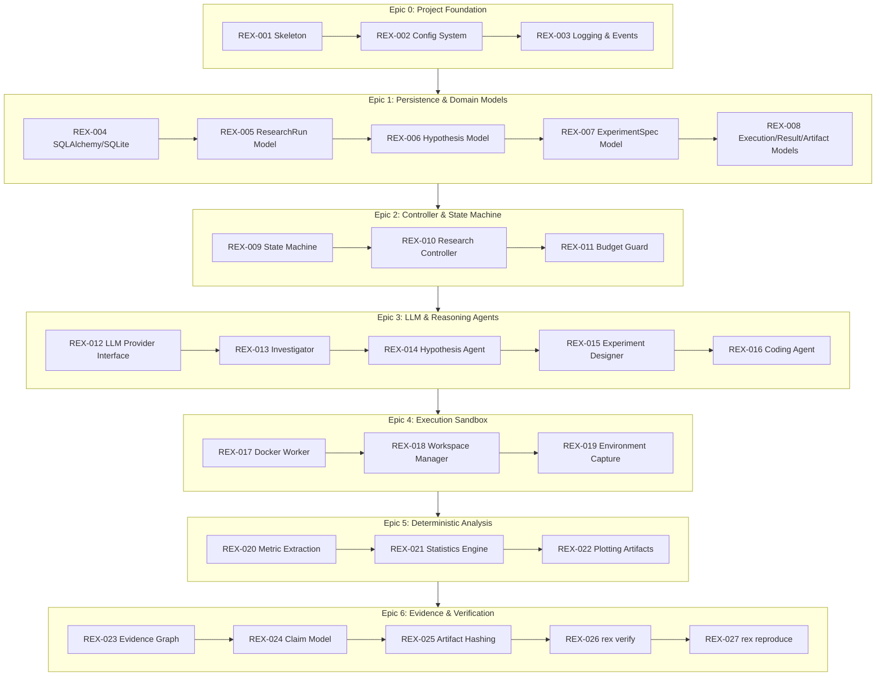

# IMPLEMENTATION_PLAN.md — REX Implementation Roadmap

## 1. Overview & Strategy

REX is implemented with strict engineering discipline and ticket-driven development based on [`05_Feature_Tickets.md`](05_Feature_Tickets.md).

Rather than attempting speculative infrastructure or skipping ahead to LLM conversational agents or UI screens, we follow an iterative, test-driven approach centered on verified vertical slices:

- **Milestone 1 — Evidence-Capable Execution Core (V1 MVP)**: 
  Domain models $\to$ configuration $\to$ SQLAlchemy/SQLite persistence $\to$ state machine $\to$ experiment specification $\to$ Docker execution/sandbox $\to$ metric capture $\to$ deterministic statistics $\to$ evidence graph $\to$ `rex verify` $\to$ evidence corruption tests.
- **Milestone 2 — Research Reasoning Agents**: 
  Problem investigator $\to$ hypothesis engine $\to$ experiment designer $\to$ coding agent $\to$ `MockLLMProvider` / live LLM providers (Gemini, Groq, OpenAI).
- **Milestone 3 — Autonomous Research Closed-Loop (V2)**: 
  Research critic $\to$ decision engine (`REFINE`, `REPLICATE`, `PIVOT`, `STOP`) $\to$ autonomous iterative experimentation with full parent-child lineage.
- **Milestone 4 — Grounded Scholarly Literature (V3)**: 
  OpenAlex / Semantic Scholar / arXiv adapters $\to$ literature prompt injection barrier.
- **Milestone 5 — Research Workstation Frontend & Evaluation**: 
  FastAPI application API $\to$ React/Vite research workstation UI $\to$ baseline-vs-REX comparative empirical evaluation.

---

## 2. Epics & Ticket Roadmap (from `05_Feature_Tickets.md`)

---

## 3. Detailed Milestone 1 Implementation Plan (V1 Foundation)

Milestone 1 establishes the deterministic research core. Execution follows ticket dependencies strictly:

| Step | Ticket | Component | Action | Verification |
| :---: | :---: | :--- | :--- | :--- |
| **1.1** | `REX-001` | Repository & Packages | Update `pyproject.toml` with `fastapi`, `uvicorn`, `sqlalchemy`, `alembic`, `docker`, `typer`. Setup package structure. | `uv pip install -e ".[dev]"` passes. |
| **1.2** | `REX-002` | `rex.config.settings` | Implement typed Pydantic `Settings` for DB, paths, Docker, LLM, limits. | Unit tests loading defaults & env overrides. |
| **1.3** | `REX-003` | `rex.observability.events` | Implement structured event logging and event persistence models. | Unit tests logging lifecycle events. |
| **1.4** | `REX-004` | `rex.persistence.database` | Setup SQLAlchemy 2.0 engine, SessionLocal, Base model, and Alembic migrations. | Tests verifying SQLite DB creation and tables. |
| **1.5** | `REX-005` | `rex.domain.research` | Implement `ResearchRun` domain & SQLAlchemy models with status transitions. | Tests creating runs and validating transitions. |
| **1.6** | `REX-006` | `rex.domain.hypothesis` | Implement `Hypothesis` domain model with falsification conditions. | Tests serialization and persistence. |
| **1.7** | `REX-007` | `rex.domain.experiment` | Implement immutable `ExperimentSpec` contract and parent/child tracking. | Tests asserting immutability after execution starts. |
| **1.8** | `REX-008` | `rex.domain.execution` | Implement `Execution`, `Result`, `Analysis`, `Artifact` models. | Tests verifying foreign key relationships. |
| **1.9** | `REX-009` | `rex.controller.state_machine` | Implement 13-state research FSM with transition guards. | Tests covering all valid and invalid transitions. |
| **1.10**| `REX-010` | `rex.controller.research_controller` | Implement orchestrator driving state transitions and experiment scheduling. | Test starting, pausing, and resuming runs. |
| **1.11**| `REX-011` | `rex.controller.budgets` | Implement budget tracking (experiments, runtime, LLM calls). | Tests verifying state machine halts at budget cap. |
| **1.12**| `REX-017` | `rex.execution.docker_runner` | Implement Docker execution worker with non-root, quotas, timeout, disabled network, and fail-safe fallback. | Test running mock execution scripts safely. |
| **1.13**| `REX-018` | `rex.execution.workspace` | Implement `WorkspaceManager` generating unique `data/runs/<research_id>/...` workspaces. | Tests verifying non-overwriting append-only paths. |
| **1.14**| `REX-019` | `rex.execution.environment` | Capture Python, pip freeze, Git commit SHA, and hardware info into `env_dump.json`. | Tests verifying captured environment snapshot. |
| **1.15**| `REX-020` | `rex.analysis.metrics` | Deterministic parsing and schema validation of `metrics.json`. | Tests rejecting malformed outputs. |
| **1.16**| `REX-021` | `rex.analysis.statistics` | Implement SciPy stats (mean, std, 95% CIs, Welch's t-test, Cohen's d). | Tests verifying numerical output against SciPy reference. |
| **1.17**| `REX-023` | `rex.evidence.graph` | Implement bidirectional evidence graph (`evidence_links` table). | Tests inserting and querying evidence edges. |
| **1.18**| `REX-024` | `rex.evidence.claims` | Implement `Claim` model requiring supporting evidence links. | Tests rejecting claims without evidence. |
| **1.19**| `REX-025` | `rex.evidence.hashing` | SHA-256 content hashing for code, configs, datasets, and artifacts. | Tests verifying hash changes on file tampering. |
| **1.20**| `REX-026` | `rex.evidence.verifier` | Build `rex verify` deterministic auditor and markdown/json reports. | Positive test: valid research run verifies cleanly. |
| **1.21**| `REX-042` | `tests/fixtures/toy_benchmark` | Deterministic toy ML task with known baselines. | Integration test running end-to-end toy experiment. |
| **1.22**| `REX-043` | `tests/security/test_corruption` | Deliberately alter metrics, hashes, or claims and confirm `rex verify` fails. | Tamper tests: 100% detection rate. |

---

## 4. Required Dependencies

Updated to align with `02_Technical_Architecture.md` and feature tickets:

### Core Runtime Dependencies
- `pydantic>=2.6.0`: Strict schema definition, immutable data models, JSON serialization.
- `typer>=0.12.0`: Deterministic CLI parsing, subcommands, and parameter validation.
- `click>=8.1.7`: Underlying CLI engine.
- `fastapi>=0.110.0` & `uvicorn>=0.28.0`: REST API and Server-Sent Events (SSE).
- `sqlalchemy>=2.0.0`: Relational ORM and database engine.
- `alembic>=1.13.0`: Database schema migrations.
- `docker>=7.0.0`: Isolated containerized experiment execution worker.
- `numpy>=1.26.0`: Numerical array manipulation and metric processing.
- `scipy>=1.12.0`: Deterministic statistical testing (Welch's $t$, Mann-Whitney, bootstrap, CIs).
- `matplotlib>=3.8.0`: Headless plotting (`Agg` backend) for deterministic figure generation.
- `psutil>=5.9.8`: Process resource tracking, memory monitoring, and process tree cleanup.
- `rich>=13.7.1`: Clean terminal tables, status spinners, and structured logs.
- `httpx>=0.27.0`: Async/sync HTTP client for LLM and literature APIs.

### Development & Test Dependencies
- `pytest>=8.0.0`: Test runner.
- `pytest-cov>=4.1.0`: Code coverage reporting.
- `pytest-mock>=3.12.0`: Mocking utilities for unit tests.
- `ruff>=0.3.0`: High-speed linting and formatting.

---

## 5. Comprehensive Test Strategy

### 5.1 Unit Tests (`tests/unit/`)
- `test_config.py`: Verify typed settings, defaults, environment variable overrides.
- `test_state_machine.py`: Validate all legal transitions and ensure illegal transitions throw `InvalidStateTransitionError`.
- `test_models.py`: Validate domain schema validation, immutability, and JSON export.
- `test_hashing.py`: Verify deterministic SHA-256 for code files, configs, and artifacts.
- `test_docker_runner.py`: Verify container configuration (quotas, non-root, disabled network, timeouts).
- `test_statistics.py`: Test statistical routines against hardcoded mathematical reference values.
- `test_persistence.py`: Test database CRUD, foreign key enforcement, and append-only constraints.

### 5.2 Integration Tests (`tests/integration/`)
- `test_execution_flow.py`: Full execution of an experiment specification from workspace generation to `metrics.json` extraction and database registration.
- `test_cli.py`: Execute `rex research`, `rex status`, `rex inspect`, `rex verify` via Typer `CliRunner`.

### 5.3 Security & Tamper Tests (`tests/security/`)
- **Tamper Test 1 (Corrupted Metric)**: Modify a metric value in `metrics.json` after execution $\to$ verify `rex verify` detects numerical mismatch.
- **Tamper Test 2 (Code Tampering)**: Modify a line in `source/run.py` without updating code version $\to$ verify `rex verify` detects SHA-256 mismatch.
- **Tamper Test 3 (Ungrounded Claim)**: Insert a claim asserting an accuracy value not found in any `Result` $\to$ verify `rex verify` flags the claim as ungrounded.
- **Tamper Test 4 (Network Disabled)**: Attempt an outbound network request inside the execution sandbox $\to$ verify it is blocked.
- **Tamper Test 5 (Host Credential Isolation)**: Verify container environment does not inherit host secret environment variables.
