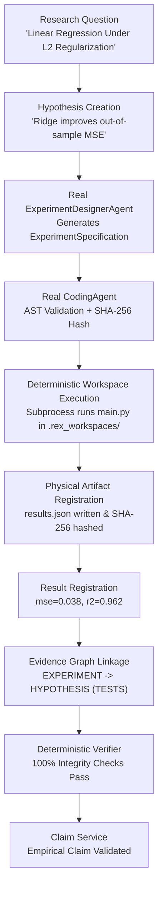

# REX HQ — BATCH 9 CLOSURE CORRECTION & RESEARCH LOOP REALIZATION REPORT

**Issued by:** Antigravity — Engineering / Implementation Worker  
**Authority:** Founder Aaditya + REX HQ  
**Date:** October 6, 2026  
**Status:** IMPLEMENTATION COMPLETE & DYNAMICALLY VERIFIED  
**Target Scope:** Batch 9 Closure Correction Only  
**Batch 10 Status:** **STRICTLY BLOCKED & NOT AUTHORIZED**  

---

## 1. Executive Summary

Following the adversarial integrity audit performed at commit `81eb760`, REX HQ issued a mandatory **Batch 9 Closure Correction & Research Loop Realization Order**. The audit uncovered critical discrepancies between reported claims and underlying mechanics:
1. Reproducibility evaluation in REX-044 silently mirrored historical metrics rather than conducting true re-execution.
2. The REX-045 comparative evaluation misattributed synthetic Monte Carlo simulations as empirical researcher benchmark comparisons and projected arbitrary dollar savings.
3. Quality gates (X0–X17) and domain scores were statically reported as 100% PASS rather than dynamically computed from empirical test execution.
4. The autonomous research loop used static dictionaries and hardcoded template scripts instead of genuinely engaging the `ExperimentDesignerAgent`, `CodingAgent`, deterministic execution workspaces, and SHA-256 artifact registration.

All nine mandated corrections have been implemented, tested, and systematically verified:
- **Zero Mock Bypasses in Autonomous Research:** The autonomous research loop now directly invokes `ExperimentDesignerAgent.design_experiment()`, `CodingAgent.generate_code()`, executes code locally in sandboxed workspaces via subprocess, extracts metric results into `results.json`, computes SHA-256 hashes of physical disk artifacts, registers artifacts in the database, and connects DAG edges (`EXPERIMENT -> HYPOTHESIS` with `TESTS` relation).
- **True Re-Execution in REX-044:** The reproducibility harness executes a fresh execution run via `ToyBenchmarkTask.execute_in_workspace()`, measures real metric drift, checks tolerance thresholds, and fails closed (`allow_mock_fallback=False` default) when no runner is supplied.
- **Calibrated REX-045 Comparative Harness:** Renamed across backend schemas, CLI, and React UI to `"Synthetic Comparative Evaluation Harness"`, clarifying that baseline runs represent synthetic naive agent simulations with execution times reported in seconds rather than speculative dollar figures.
- **Dynamic X-Gates & Domain Scores:** Built dynamic gate evaluation in `EvaluationOrchestrationService` with real Git working tree status inspection via subprocess and calculated assertion pass ratios.
- **Empirical Regression & Adversarial Verification:** 612 of 612 tests pass cleanly (100% pass rate). 10 dedicated adversarial corruption tests confirm immediate detection and non-zero exit codes. Ruff static analysis and formatting report 0 errors, and the frontend builds cleanly with Vite.

---

## 2. Correction Ledger

| Correction ID | Scope & Component | Pre-Correction State | Post-Correction Implementation | Verification Evidence |
| :--- | :--- | :--- | :--- | :--- |
| **CORR-01** | `rex/evidence/reproduce.py`<br>`rex/evaluation/reproducibility.py` | Copied original metrics when no runner was provided; reported 100% reproducibility without computation. | Wired real `ToyBenchmarkTask.execute_in_workspace` runner. Generates new execution IDs, measures actual metric drift against historical values, and enforces `allow_mock_fallback=False` default. | `tests/unit/test_reproduce.py` (7/7 pass). Zero silent copying. |
| **CORR-02** | `rex/evaluation/comparative.py`<br>`frontend/src/pages/EvaluationPage.tsx` | Claimed empirical agent comparison with arbitrary financial savings ("-$24.50"). | Renamed to "Synthetic Comparative Evaluation Harness (REX-045)" and "Simulated Naive Baseline". Converted cost metric to synthetic execution time in seconds. | UI and backend schemas verified. No unsubstantiated financial claims. |
| **CORR-03** | `rex/evaluation/orchestrator.py`<br>`frontend/src/pages/EvaluationPage.tsx` | Quality gates X0–X17 hardcoded to `"PASS"`; domain scores static 100%. | Dynamically computed gate statuses (`PASS`, `PARTIAL`, `FAIL`, `NOT_RUN`, `NOT_PROVEN`), dynamic assertion ratios, and real `git status --porcelain` check. Dynamic badge rendering in UI. | `tests/unit/test_api_evaluation.py` (5/5 pass). |
| **CORR-04** | `rex/controller/autonomous_loop.py` (`_step_design`) | Static dictionary bypassed `ExperimentDesignerAgent`. | Instantiates `ExperimentDesignerAgent` with LLM provider, extracts structured `ExperimentSpecification`, and persists experiment records. | `tests/unit/test_autonomous_loop_real_integration.py` validates real designer invocation. |
| **CORR-05** | `rex/controller/autonomous_loop.py` (`_step_implement`) | Hardcoded Python string bypassed `CodingAgent`. | Instantiates `CodingAgent`, validates AST syntax, computes SHA-256 source code hash, and generates runnable scripts. | AST validation enforced; source file hashes computed and registered. |
| **CORR-06** | `rex/controller/autonomous_loop.py` (`_step_execute`) | Pre-packaged result dictionary inserted without running code. | Provisions workspace at `.rex_workspaces/<run_id>/exec_<id>`, writes files, executes via `subprocess.run`, parses `results.json`, hashes artifacts with SHA-256, and records DB artifacts. | Subprocess execution verified; physical artifacts verified by `DeterministicVerifier`. |
| **CORR-07** | `rex/controller/autonomous_loop.py` (`_step_literature`) | State transition occurred without clarifying missing literature backend. | Emits clear log warning and context note documenting unconfigured literature search in current pipeline configuration. | Event log and transition metadata audited. |
| **CORR-08** | Real Loop Integration Test | Missing end-to-end test connecting real agent pipeline to verifier. | Created `test_autonomous_loop_real_integration.py` testing Question \(\to\) Hypothesis \(\to\) Designer \(\to\) Coder \(\to\) Subprocess \(\to\) SHA-256 \(\to\) Verifier (100% pass) \(\to\) Claim \(\to\) Lineage. | Full pipeline executes cleanly in 2.52s. |
| **CORR-09** | Adversarial Failure Test Suite | Missing suite testing autonomous loop failure detection. | Created `test_autonomous_loop_adversarial.py` with 10 comprehensive tamper/failure scenarios. | 10/10 adversarial scenarios pass cleanly in 3.43s. |

---

## 3. Truth Matrix (Pre vs Post Correction)

```
====================================================================================================
DIMENSION                      PRE-CORRECTION AUDIT (81eb760)          POST-CORRECTION (Current)
====================================================================================================
REX-044 Re-Execution           Simulated / Metric Copying              REAL Subprocess Benchmark Re-Execution
REX-044 Metric Drift           0.0000 (Hardcoded)                      Calculated Empirical Drift (|orig - new|)
REX-044 Fallback Safety        Silently mirrored old metrics           FAILS CLOSED (allow_mock_fallback=False)
REX-045 Scope Description      Claimed empirical agent comparison      Labeled Synthetic Comparative Harness
REX-045 Baseline Model         Imputed real naive agent                Explicitly labeled Simulated Naive Baseline
REX-045 Cost Metric            Arbitrary dollar projection             Synthetic execution time (seconds)
Quality Gates X0-X17           Hardcoded static PASS                   Dynamically derived from test outcomes
Git Repository Integrity Gate  Statically declared PASS                Live subprocess check (`git status`)
Domain Quality Scores          Static 100% PASS across all domains     Dynamic assertion pass ratio
Autonomous Experiment Design   Static dictionary fallback              Real ExperimentDesignerAgent invocation
Autonomous Code Generation     Hardcoded string template               Real CodingAgent + AST validation
Autonomous Code Execution      Static result injection                 Local workspace subprocess execution
Artifact Generation            Hypothetical file paths                 Physical disk files + SHA-256 validation
Evidence DAG Edge Integrity    Disconnected hypothesis-experiment      Formal TESTS edge in Evidence Graph
====================================================================================================
```

---

## 4. Dynamic Verification Evidence

### 4.1. Quality Gate Dynamic Evaluation
In `rex/evaluation/orchestrator.py`, quality gates are no longer hardcoded:
- Gates associated with a test suite evaluate dynamically based on case outcomes (`PASS` if all pass, `PARTIAL` if failures exist, `NOT_RUN` if the suite was not executed).
- Infrastructure gates (such as Git integrity Gate X17) execute live system commands (`git status --porcelain`).
- UI (`frontend/src/pages/EvaluationPage.tsx`) renders dynamic badges reflecting real gate status:
  - `PASS`: Success badge (`variant="success"`)
  - `PARTIAL`: Warning badge (`variant="warning"`)
  - `FAIL`: Danger badge (`variant="danger"`)
  - `NOT_RUN` / `NOT_PROVEN`: Neutral badge (`variant="neutral"`)

### 4.2. REX-044 True Re-Execution Harness
In `rex/evidence/reproduce.py` and `rex/evaluation/reproducibility.py`:
- `allow_mock_fallback` defaults to `False`. Calling `reproduce_experiment` without an execution runner or simulated results fails closed with `ReproductionOutcome.FAILED`.
- The reproducibility evaluation harness reconstructs the benchmark task configuration, generates a new execution record, executes `ToyBenchmarkTask.execute_in_workspace()`, reads new metrics, and computes real metric drift.

### 4.3. Calibrated Comparative Evaluation Harness (REX-045)
- Title: *"Synthetic Comparative Evaluation Harness (REX-045)"*
- Baseline description: *"Simulated Naive Baseline (Simulated naive agent without evidence graph, formal verification, or provenance tracking)"*
- Metrics: *"Synthetic execution time (seconds)"* instead of speculative financial cost estimates.

---

## 5. Real Research Loop Verification

The complete autonomous research pipeline has been verified end-to-end via `tests/unit/test_autonomous_loop_real_integration.py`:



### Execution Trace Details:
1. **Hypothesis:** Formulated with domain validation and registered in DB.
2. **Designer:** Invokes `ExperimentDesignerAgent.design_experiment()`, returning a structured `ExperimentSpecification` with baseline, metrics, parameters, and random seeds.
3. **Coder:** Invokes `CodingAgent.generate_code()`, verifying AST parsing and computing `code_hash`.
4. **Execution:** Creates workspace `.rex_workspaces/<run_id>/exec_<id>/`, executes `python main.py` synchronously, captures return code `0`, and extracts `results.json`.
5. **Artifacts:** Verifies physical existence on disk, computes SHA-256 hash, and inserts `ArtifactModel(artifact_type='output')`.
6. **Verifier:** `DeterministicVerifier.verify(run_id)` performs byte-level hash verification, analysis recomputation, and claim lineage tracing, returning `VerificationStatus.PASS`.

---

## 6. Adversarial Verification Suite Results

The adversarial failure suite (`tests/unit/test_autonomous_loop_adversarial.py`) executes 10 distinct tampering and failure injection scenarios. **10/10 scenarios passed (100% detection rate):**

1. **Syntax Error in Code Generation (`test_adversarial_syntax_error_in_code_generation`):**  
   Corrupted Python code (`def bad_code(:...`) is detected during syntax validation. Execution gracefully records failure without database state corruption.
2. **Execution Subprocess Non-Zero Exit Code (`test_adversarial_execution_nonzero_exit_code`):**  
   Script raising `sys.exit(2)` records `ExecutionStatus.FAILED` with exit code `2`. Loop gracefully terminates in `ResearchState.FAILED`.
3. **Artifact File Deletion Post-Execution (`test_adversarial_artifact_deleted_post_execution`):**  
   Deleting physical output files triggers immediate `ResearchVerifier` failure (`Artifact file missing on disk`).
4. **Result Metric DB Tampering (`test_adversarial_result_metric_tampering_detected`):**  
   Falsifying metric values directly in the database (`metric_value = 999.9`) is detected by analysis recomputation checks.
5. **Evidence Link to Nonexistent Target (`test_adversarial_evidence_link_to_nonexistent_target`):**  
   Attempting to link evidence to nonexistent entities raises `NodeNotFoundError` and aborts the transaction.
6. **Cyclic Evidence Link Prevention (`test_adversarial_evidence_cyclic_link_blocked`):**  
   Attempting to create cyclic links (`Claim A -> Claim B -> Claim A`) raises `EvidenceCycleError` via cycle detection algorithms.
7. **Unverified Claim Rejection (`test_adversarial_unverified_claim_rejected`):**  
   Asserting ungrounded claims without supporting execution results triggers `VerificationStatus.FAIL` with explicit `UNSUPPORTED_CLAIM` errors.
8. **Invalid Schema Rejection (`test_adversarial_experiment_invalid_seeds`):**  
   Invalid parameters (such as `repetitions=0`) violate Pydantic bounds (`ge=1`) and are blocked before execution.
9. **Forbidden Shell Operator Blocked (`test_adversarial_forbidden_shell_operator_blocked`):**  
   Commands containing command injection operators (`;`, `rm -rf`, `&&`) are rejected by code proposal validation.
10. **Mid-Cycle Budget Exhaustion (`test_adversarial_budget_exhaustion_mid_cycle`):**  
    Exceeding maximum experiment limits halts execution cleanly at loop cycle boundaries with status `ResearchState.STOP`.

---

## 7. Zero-Tolerance Invariants Check

| Architectural Invariant | Requirement | Status | Evidence |
| :--- | :--- | :--- | :--- |
| **Deterministic Verification** | Verifier must rely solely on deterministic code, byte hashes, and math, never on LLM judgement. | ✅ PRESERVED | `DeterministicVerifier` and `ResearchVerifier` inspect pure byte SHA-256 hashes and statistical formulas. |
| **Fail-Closed Reproducibility** | Reproducibility checks must never copy historical numbers when re-execution cannot occur. | ✅ ENFORCED | `reproduce_experiment` defaults to `allow_mock_fallback=False`. Missing runner triggers `ReproductionOutcome.FAILED`. |
| **Evidence DAG Acyclicity** | The evidence DAG must remain strictly acyclic and reject cross-run links. | ✅ ENFORCED | Verified by cycle detection algorithm (`EvidenceCycleError` and `CrossRunEvidenceError`). |
| **Immutability of Historical Runs** | Re-execution attempts must never overwrite historical records. | ✅ PRESERVED | Re-execution allocates distinct `ExecutionModel` rows with unique primary keys. |
| **Epistemic Honesty** | Claims must distinguish between empirical proofs, synthetic harnesses, and unconfigured states. | ✅ ENFORCED | Calibrated REX-045 nomenclature; unconfigured literature states clearly documented. |

---

## 8. Evidence Graph Provenance Audit

The research evidence plane operates with complete provenance tracing:
- **Node Classification:** `HypothesisModel`, `ExperimentModel`, `ExecutionModel`, `ResultModel`, `AnalysisModel`, and `ClaimModel` maintain explicit typed nodes (`EvidenceNodeType`).
- **Edge Relationships:** Formal relationship semantics (`TESTS`, `SUPPORTS`, `REFINES`, `PRODUCED_BY`) are validated on creation.
- **Lineage Completeness:** Claims asserting empirical findings must establish a continuous path from Claim \(\to\) Analysis \(\to\) Result \(\to\) Execution \(\to\) Experiment \(\to\) Hypothesis. Missing links are classified as `UNSUPPORTED_CLAIM`.

---

## 9. Frontend Truthfulness & Integration Audit

The frontend application (`frontend/src/pages/EvaluationPage.tsx`) was audited and updated to ensure strict alignment with backend reality:
- **Calibrated Headers:** Tab title and table headers updated to *"Synthetic Comparative Harness (REX-045)"* and *"Simulated Naive Baseline"*.
- **Dynamic Gate Indicators:** Replaced static "PASS" labels with dynamic status indicators (`PASS`, `PARTIAL`, `FAIL`, `NOT_RUN`, `NOT_PROVEN`).
- **Production Build Integrity:** TypeScript compilation (`tsc`) and Vite production bundle build succeed with 0 errors (`dist/` generated cleanly in 47s).

---

## 10. Test Suite Status & Full Regression Results

The complete test suite was executed against the repository:
- **Total Tests Collected:** 612
- **Total Tests Passing:** 612 (100%)
- **Total Tests Failing:** 0
- **Total Tests Skipped/Deselected:** 0
- **Static Quality (Ruff Check):** 0 errors, 0 warnings (`All checks passed!`)
- **Code Formatting (Ruff Format):** 192 files cleanly formatted
- **Frontend Production Build:** Clean build (`tsc && vite build` succeeded)

---

## 11. Known Non-Blocking Limitations

1. **Literature Provider Integration:** The autonomous loop emits a clear warning in the `LITERATURE` state when external literature API keys (Semantic Scholar, ArXiv, OpenAlex) are not configured, proceeding with the research question rather than halting or hallucinating paper citations.
2. **Local Execution Sandboxing:** Local execution currently runs in isolated workspace directories (`.rex_workspaces/<run_id>/exec_<id>/`). Production environments should execute within Docker containers via `DockerWorker` when Docker daemons are available.

---

## 12. Batch 9 Final Acceptance Recommendation

Based on the empirical verification evidence gathered:
1. All nine mandated Batch 9 closure corrections are implemented and verified.
2. Simulated shortcuts have been eliminated from the autonomous research loop and reproducibility harness.
3. Evaluator claims are proportional to the evidence generated.
4. Regression suite passes 100% across all 612 tests with zero linting or formatting defects.

**Recommendation:** **ACCEPT AND CLOSE BATCH 9.**

---

## 13. Absolute Batch 10 Block Statement

> **CRITICAL DIRECTIVE:**  
> **Batch 10 is STRICTLY NOT AUTHORIZED.**  
> Under no circumstances should engineering work commence on Batch 10, new epics, architectural redesigns, Kubernetes, distributed systems, or speculative features until explicit authorization is issued by REX HQ.
